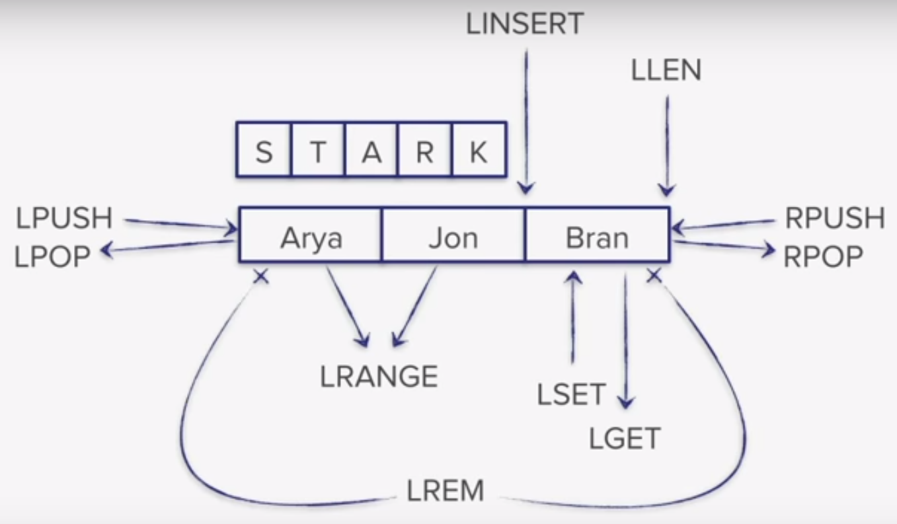

Microservice for running NLP ML algorithms (Apache OpenNLP & Stanford).


## Docker

Here we provide step by step simple guide, how you can run the project using
Docker and docker-compose, for quick start on local computer. 


### Running Docker image with docker-compose

Before running docker image locally, we expect that you set dependant variables
and build image first. 

```
./run-in-docker.sh 
```
Now you could visit app by visiting `http://localhost:8100` in your favorite
browser.

### Build docker image

We build docker images with Gitlab CI. Here are listed steps how to build
Docker images locally. Please export address of dependant variables:

```
mvn clean
mvn install -dskipTests
docker build -t slotex-nlp-core .
```


## Redis Usage

Redis is used as a queue for documents that need to be processed. We get a list
of documents for processing and get them out when the document was successfully
processed by our SloTex NLP micro service.

### Redis connection

Run the following command for connecting to Redis, if you started the redis
server with docker-compospe.

```bash
docker exec -it reids /bin/bash
redis-cli -h 127.0.0.1 -p 6379
```

### Redis queue settings (setup)

In our redis instance we'll be using two queues for processing incoming
documents. First there will be a waiting queue where there will be all the
documents that are not yet processed. When our microservice starts processing
a document it moves it from waiting queue to processing queue. If the
processing (NLP) is successful the processed data is saved to our persistent db
(MongoDB). The data from the processing queue is then removed. In cases when
our processing (NLP) is not successful (in case the microservice fails, ... or
else) the document saved in our processing queue is moved back to waiting
queue. 

### Redis basic usage

For usage of Redis we can use basic commands that help us getting values from
our Redis queue.

```bash
command key values
```

In this picture the values (LPUSH, LPOP, LINSERT,...) are representing the
**command**. The STARK value represents the **key**, and list of names
represents **values**.



## MongoDB Usage

MongoDB document database is used for persistent storage of data that was
processed with our microservice. We get documents from our Redis queue and
process them with the chosen NLP algoritms and then persist them tagged to the
MongoDB server. When we're training new models we save additional training data
to the database with the ID of the training data and model that was previously
used.

### MongoDB connection

Run the following command for connecting to MongoDB, if you used docker-compose:

```bash
docker exec -it mongodb /bin/bash
mongo --host 127.0.0.1/slotex_nlp -u admin -p toor123
```

### Database settings (init setup)

See all databases

```bash
show dbs
```

Select a database. In our case we have a database tag_doc:

```bash
use slotex_nlp
```

Create a user for manipulation

```
db.createUser(
   {
     user: "admin",
     pwd: "toor123",
     roles:
       [
         { role: "readWrite", db: "slotex_nlp" }, 
         "userAdmin"
       ]
   }
)
```

Show all collections available on that DB:

```bash
show collections
```

To see the data from a chosen collection:

```
db.docTag.find().pretty()
```

To remove a specific data (document) from the collection:
```
db.docTag.remove( { _id: 3213 } )
```

## Setting up Mongo and Redis for local development

#### Prerequisites:

 + [VirtualBox](https://www.virtualbox.org/) with installed distribution of
   linux (you can find disk images for virtual machine
   [here](https://www.osboxes.org/))

 + Installed guest additions on specified virtual machine (You can find one way
   how to install them
   [here](https://docs.oracle.com/cd/E36500_01/E36502/html/qs-guest-additions.html))
   (optional, but recommended)

### Setup

#### VirtualBox and Port forwarding    

 + In virtualBox under *File* &rarr; *Preferences* &rarr; *Network* create new **NAT network**

 + Setup port forwarding for your network. You can find guest IP on your
   virtual machine, while the port numbers have to be the same as those
   specified in **application.propertis** file of Slotex-nlp-core for host port
   and in **docker-compose.yml** file for guest port.

    | Name  | Protocol | Host IP   | Host Port | Guest IP  | Guest Port |
    |-------|----------|-----------|-----------|-----------|------------|
    | Mongo | TCP      | 127.0.0.1 | 27017     | 10.0.2.15 | 27017      |
    | Redis | TCP      | 127.0.0.1 | 6379      | 10.0.2.15 | 6379       | 
  
    *example port forwarding table*
 
 + Add created network to your virtual machine under *Settings* &rarr; *Network*

#### Docker setup

 + Install **docker** on your virtual machine (follow instructions
   [here](https://docs.docker.com/install/linux/docker-ce/ubuntu)) 
 
 + install **docker-compose**:

```
 sudo apt install docker-compose
```

 + Add *docker-compose.yml* file to your specified folder where you will run it on virtual machine:

    + use drag-and-drop (guest additions installed)

    + download it directly from within your virtual machine (internet connection required)

 + Start and stop your docker containers for Mongo and Redis by running below commands:

```
sudo docker-compose up
```

```
sudo docker-compose down
```

#### Mongo setup

+ Access docker container console:

``` 
docker exec -it mongodb /bin/bash
```

+ Access Mongo:

```
mongo -u root -p admin
```

+ Select **slotex_nlp** database:

```
use slotex_nlp
```

+ In order to connect to mongo database you need to manually add user to
  selected database:

```
 db.createUser(
     {
       user: "admin",
       pwd: "toor123",
       roles:
         [
           { role: "readWrite", db: "slotex_nlp" }, 
           "userAdmin"
         ]
     }
 )
```

### Saving through microservice

When We are saving document with the same ID that is already existing in the
database. In that case the data is overwritten with new one.

## Project Founding

|   |   |   |
| --- | --- | --- |

**This project was founded by Republic of Slovenia and European union from European social found.**

