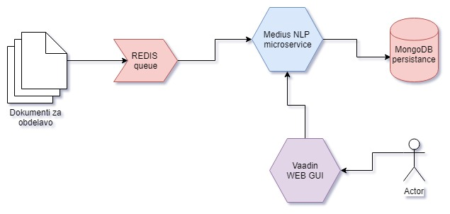

# SloTex NLP Core

Microservice for running NLP ML algorithms (Apache OpenNLP & Stanford).



## Installation using Docker

### Build docker image

We build docker images with Gitlab CI. Here are listed steps how to build
Docker images locally. Please export address of dependant variables:


```
mvn clean
mvn install -dskipTests
mkdir -p conf
cp deploy/docker/Dockerfile .
cp -r src/main/resources/* conf/
cp deploy/docker/conf/*.in conf/
export MEDIUS_NLP_SERVICE="http://localhost:8100"
export MONGODB_AUTHENTICATION=medius_nlp
export MONGODB_USERNAME=admin
export MONGODB_PASSWORD=toor123
export MONGODB_DATABASE=medius_nlp
export MONGODB_PORT=22017
export MONGODB_HOST=127.0.0.1
export REDIS_HOST=localhost
export REDIS_PORT=6379
deploy/ci/env-process-template.sh conf/*.in conf/
docker build my-slotex-nlp .
```

## Running Docker image

Before running docker image locally, we expect that you set dependant variables
and build image first. You could always use `localhost` for `MONGODB_HOST` or
`REDIS_HOST`, even if you have deployed those two on K8s cluster. But you have
to expose host network.

```bash
docker run --name slotex-nlp -it -p8100:8100 --network="host" my-slotex-nlp 
```

Now you could visit app by visiting `http://localhost:8080` in your favorite
browser.


## Redis Usage

Redis is used as a queue for documents that need to be processed. We get a list of documents for processing and get them out when the document was successfully processed by our Medius NLP 
micro service.

### Redis connection

Run the following command for connecting to Redis:

```bash
redis-cli -h 127.0.0.1 -p 6379
```

### Redis queue settings (setup)

In our redis instance we'll be using two queues for processing incoming documents. First there will be a waiting queue where there will be all the documents that are not yet processed. When 
our microservice starts processing a document it moves it from waiting queue to processing queue. If the processing (NLP) is successful the processed data is saved to our persistent db (MongoDB). 
The data from the processing queue is then removed. In cases when our processing (NLP) is not successful (in case the microservice fails, ... or else) the document saved in our processing queue 
is moved back to waiting queue. 

### Redis basic usage

For usage of Redis we can use basic commands that help us getting values from our Redis queue.

```bash
command key values
```

In this picture the values (LPUSH, LPOP, LINSERT,...) are representing the **command**. The STARK value represents the **key**, and list of names represents **values**.


## MongoDB Usage

MongoDB document database is used for persistent storage of data that was processed with our microservice. We get documents from our Redis queue and process them with the chosen NLP algoritms
and then persist them tagged to the MongoDB server. When we're training new models we save additional training data to the database with the ID of the training data and model that was previously used.

### MongoDB connection

Run the following command for connecting to MongoDB:

```bash
mongo --host 127.0.0.1 -p fwhr2N55mB
```

### Database settings (setup)
>See all databases

```bash
show dbs
```

>Select a database. In our case we have a database tag_doc:
```bash
use medius_nlp
```

>Create a user for manipulation
```
db.createUser(
   {
     user: "admin",
     pwd: "toor123",
     roles:
       [
         { role: "readWrite", db: "medius_nlp" }, 
         "userAdmin"
       ]
   }
)
```

>Show all collections available on that DB:
```bash
show collections
```

>To see the data from a chosen collection:
```
> db.docTag.find().pretty()
```

>To remove a specific data (document) from the collection:
```
> db.docTag.remove( { _id: 3213 } )
```

### Saving through microservice

When We are saving document with the same ID that is already existing in the database. In that case the data is overwritten with new one.
